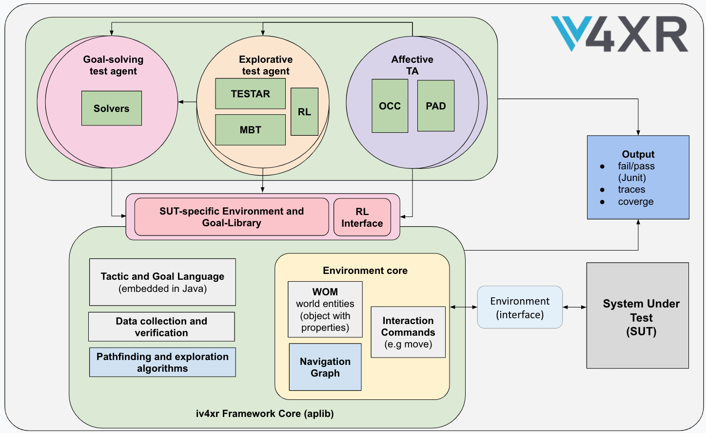
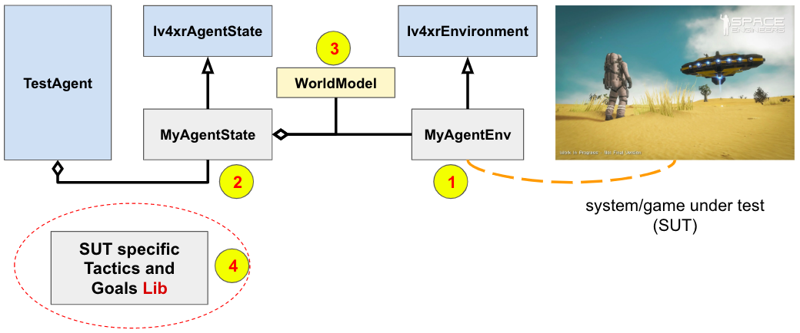

# iv4xr-framework

The _iv4xr Framework_ is an agent-based framework for automated testing highly interactive systems such as computer games or computer simulators. Its cool features include intelligent agents, player experience testing, and integration with other tools such as Model based Testing (MBT) and TESTAR.

Although above we mention "games", iv4xr itself is generic enough to target other types of interactive systems, even services or Java classes as long as these entities can be viewed as interactable systems.

Iv4xr is a _framework_ because it is not a tool that can immediately do its work out of the box --this is not possible due to the unstandardized domains of its targets. E.g. there is no uniform way to interface with computer games, and there is no uniform representation of their states either. So before it can be used, iv4xr Framework requires an interface to be built that would allow it to control and observe the target system under test (SUT).

**Note:** _iv4xr_ itself stands for "intelligent verification/validation for extended reality (XR) based systems".
During its development we have focused on piloting the Framework for testing 3D games. Solving testing problems in 3D worlds provides the foundation for testing XR systems in general. E.g. a virtual reality (VR) application typically operates on an interactive 3D virtual world. While the used devices are different (VR glass, hand tracker), and will have separate concerns to be tested, much of the correctness of its 3D world would be independent of the used devices, and therefore shares much of the aspects of that of 3D games.
Testing an Augmented Reality (AR) application is very costly as it requires a physical agent (e.g. a robot) that interacts with our physical world. A mitigation of this is by first testing (and also re-testing) the application in a simulated 3D environment (hence reducing e.g. the frequency of costly physical re-test, or even its extent), for which we can fall back to a 3D world setup which iv4xr can address.

_Iv4xr architecture_.

#### Features

  * **Tactical and goal-based agent programming** to implement test automation, e.g. to perform automated navigation to a certain destination, to program logic that handles adversaries, and to program complex scenarios. There is support for automated path finding and automated area exploration. And yes, iv4xr supports **multi agent** as well.

  * **Tracing and verification:** test agents can collect execution traces during lengthy test scenarios. Assertions and Linear Temporal Logic (LTL) can be used for checking correctness, either live during test runs, or post-mortem on collected traces. Beyond verification, traces can be processed in various ways. E.g. they typically contain the agents' positions, whcih can be aggregated to visualise (or calculate) the physical area coverage of the tests.

  * **Affective testing**: using models of users' emotion to facilitate automated user experience (UX) assessment. Emotion models are obtained either by learning them from data, or crafted. Such a model can either be attached to a test agent or applied to execution traces to produce emotion traces. UX requirements formulated, e.g. regular expression or LTL, which are then evaluated on emotion traces.

  * **Automated explorative testing** with the TESTAR agent that automatically executes non-sequential actions to navigate, interact and test that the System Under Test (SUT) and the functional aspects of the virtual entities are robust enough to respond to different user interactions. This agent automatically creates visual reports for end users and can infer a State Model that maps the information regarding the observed states and executed actions.

  * **Model based testing**: this allows good quality test suites to be rapidly generated using state of the art search-based testing algorithms **[FBK modify/add]**.

  * **Reinforcement learning** **[what should we say here? :)]**

### How to build and what are in this project

Just run `mvn compile` from the project root. This should download and build all the Framework's components.  

The project's main programming languages are Java and Python. The framework's components have been developed separately in their own  repositories, and this project packages them in a single project and provides a top-level hyperlinked documentation for the whole framework.
Java components are automatically included as jar-files. Python components may have to be obtained from their repository; this will be indicated by their corresponding documentation-section in this project.

Since this project integrates jars, you do not get the source code. To get the source code you need to go to their respective repository.
If you need the source code, they can be obtained from the respective
repository of the components; they should be linked from their respective documentation-section.
For convenience, we list some below:

* [The agent-based testing core component](https://github.com/iv4xr-project/aplib)
* [Explorative testing TESTAR component](https://github.com/iv4xr-project/TESTAR_iv4xr)
* [Model-based testing component](https://github.com/iv4xr-project/iv4xr-mbt)

### Using the project

You can either use this project as your base, and extend it. Or, you
can import this project as a maven dependency.

## Manuals

The manuals consist of hyper-linked documents, grouped into several sections below.

### Section 1: Setup and Architecture

As mention before, as a framework iv4xr is not something we can use out of the box. We first need to construct several components to connect it to a given SUT, and to provide some basic automation, which latter at the higher level can be combined to deliver more powerful automation. The picture below shows the typical architecture for facilitating iv4xr use. The SUT is assumed to be a computer game; though in principle it can be any interactive system.
Some of these components are SUT-specific, so it is not possible to provide them generically. Building these will require some effort; but it is a one-off investment, after which the built infrastructure can be reused over and over to do automated testing.

Along with a test agent, the following components are needed:

1. An implementation of the class `Iv4xrEnvironment`, responsible for handling the interaction with the system under test (SUT), such as sending a command to the SUT and to obtain observation of the SUT state.

1. A direct instance or an implementation of `Iv4xrAgentState` to hold the agent's state. Among other things, this state will hold a `WorldModel` as a generic representation of the SUT's gamestate.

1. A `WorldModel` also contains one or more `WorldEntity`; each represent a gameobject in the SUT. WorldModel and WorldEntity are generic representations, regardless the SUT. We will thus need to build a translator, that translates actual gameobjects and gamestate to WorldEntity and WorldModel.

1. To do something smart, such as automatically navigating to a destination, your agent will need a bunch of tactics and goals. These are game-specific, so you will also need to construct a library of these. Iv4xr supports you e.g. by providing pathfinding and exploration algorithms.

More on this will be explain in a documentation in Section 2 below.

### Section 2: Basic iv4xr

This section introduces the basic concepts of agent programming and agent-based testing in iv4xr and provides tutorials and examples.

* [iv4xr agent programming and tutorials](https://github.com/iv4xr-project/aplib/blob/master/docs/agentprogramming.md). This is the recommended starting point. The document introduces basic iv4xr agent concepts, such as tactic and goal. It also provides several tutorials.

* The paper below provides more in-depth explanation of iv4xr agent concepts. It also explains agent's **execution model**. It should be noted that an agent executes quite differently than e.g. procedures or methods. This is explained in this [arxiv paper](https://arxiv.org/pdf/1911.04710).

* **Agent-based testing** [manuals and tutorials](https://github.com/iv4xr-project/aplib/blob/master/docs/agentbasedtesting.md). The tutorials show how to use iv4xr agents to test computer games. We will start with a simple/artificial game, and then an example with a more realistic game will be given. This includes further workout of the implementation of the [architecture](#section1) from Section 1.

* A summary of the Domain Specific Language (DSL)/APIs for constructing tactics and goals: [here](https://github.com/iv4xr-project/aplib/blob/master/docs/manual/DSL.md).

* [iv4xr-core/aplib project](https://github.com/iv4xr-project/aplib): this is the project that contains iv4xr's Core; the one that provides test agents and their core capabilities. It also provides the underlying agent programming.

### Section 3: Use Cases

Iv4xr provides more than just basic test agents. The features include e.g. explorative testing and user/player experience testing. This section explains several typical use cases of iv4xr testing, making use its features.

Regardless the use case, note that iv4xr always need an [interface for controlling and observing the SUT](#section1) and its related components, as explained in Section 1.

#### Use case: pure agent-based testing.

You want to do automated testing using goal-based agents. In this setup, we use a goal structure to formulate a single testing task/test scenario, e.g. to verify that the scenario ends in a correct state. Such a task can be given to a test agent to be executed. Using this scheme, multiple scenarios can automated (you can also think of a layer on top of this that would generate the scenarios). For this kind of use case you do not need anything extra.

* Documentations: [see the manuals in Section 2](#section2)

#### Use case: testing with an explorative agent.

You want to have an agent that does not follow specific instructions, such as a set of tactics and goals or crafted models to test specific paths and interactions, but that automatically executes non-sequential actions to test that the computer game system and its entity's functional aspects are robust enough to respond to different and unexpected user interactions. You need to configure and use the TESTAR protocols to act as our explorative test agent.

* [Documentation](./docs/testar/TESTAR.md)

#### Use case: model based testing.

You want to do **model-based testing (MBT) on e.g. a computer game**. This needs a model, but on the other hand the benefit is that you can easily (and rapidly) generate test suites.

* [Documentation](./docs/mbt/MBT.md)

#### Use case: player experience testing

You want to do player experience (PX) testing. There are several approaches that you can take, either one that is based on machine learning, or one that is model-based:

* Using PAD approach (model free): [Documentation]
* Using the OCC approach (model based): [Documentation](./docs/occ/occ-emotion.md)

#### Use case: you want to use reinforcement testing.

You want to use iv4xr agent(s) to train a Reinforcement Learning (RL) agent with the goal to train the RL agent to test the SUT. In this setup the iv4xr-agent just serves as a proxy between the RL-agent and the SUT. The RL agent is given a set of possible actions to try out as part of its learning. The iv4xr-agent is just used for executing actions chosen by the RL-agent. An action here can either be a primitive action or a whole goal-structure, depending on how you want to set it up.

[TO DO, Thales, FBK]

* Thales-way: [Documentation]
* FBK-way: [Documentation]
* Light weight bridge (socket-based) allowing Python RL to target a Java-side Gym: [Japyre](https://github.com/iv4xr-project/japyre)

#### Case studies

(TODO: GoodAI,Thales,GW,all add links to your case studies, papers here)

* _Space Engineers_ is a complex 3D game made by Keen Software. Brief on how iv4xr is used. LINK-to-case-study-project
* Nuclear plant simulator, brief on the case study and how iv4xr is used; LINK
* LiveSite, brief on the case study and how iv4xr is used; LINK
* _Lab Recruits_ is 3D maze-puzzle game. Iv4xr has been used to experiment with various forms of automated testing on this game. [Project and demo](https://github.com/iv4xr-project/iv4xrDemo).

### License

### Papers [(full list here)](./docs/papers.md)

(TODO: all -> add your main papers here, the rest in docs/papers.md)

  * Concepts behind agent-based automated testing:
    [_Aplib: Tactical Agents for Testing Computer Games_](https://link.springer.com/chapter/10.1007/978-3-030-66534-0_2) I. S. W. B. Prasetya, Mehdi Dastani, Rui Prada, Tanja E. J. Vos, Frank Dignum, Fitsum Kifetew,
  in Engineering Multi-Agent Systems workshop (EMAS), 2020.

  * R. Ferdous, F. M. Kifetew, D. Prandi, I. S. W. B. Prasetya, S. Shirzadehhajimahmood, A. Susi. _Search-based automated play testing of computer games: A model-based approach._
  13th International Symposium, SSBSE 2021.
  [doi:10.1007/978-3-030-88106-1_5](https://link.springer.com/chapter/10.1007/978-3-030-88106-1_5)

  * Vos, T. E., Aho, P., Pastor Ricos, F., Rodriguez Valdes, O., & Mulders, A. (2021). *testar–scriptless testing through graphical user interface.* Software Testing, Verification and Reliability, 31(3), e1771. [doi.org/10.1002/stvr.1771](https://doi.org/10.1002/stvr.1771)  

  * [_An Appraisal Transition System for Event-Driven Emotions in Agent-Based Player Experience Testing_](https://doi.org/10.1007/978-3-030-97457-2_9), Ansari, Prasetya, Dastani, Dignum, Keller. In International Workshop on Engineering Multi-Agent Systems (EMAS), 2021.
