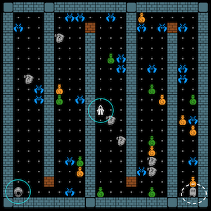

# Demos

## Simple demos with a 2D game MiniDungeon

These demos are simple to setup. The demos show a number of automated tests on a simple 2D game as the system under test (SUT). The game is called _MiniDungeon_ which has the flavour of the Nethack game from 80's.



**If you first want to play the game** (could be fun...): run the class [`DemoPlayMiniDungeon`](../src/main/java/nl/uu/cs/aplib/exampleUsages/miniDungeon/DemoPlayMiniDungeon.java) . The simplest way to run the class is using Maven:

   * Clone the iv4xr-framework project. Then from the project root, run:

   ```mvn compile exec:java -Dexec.mainClass=nl.uu.cs.aplib.exampleUsages.miniDungeon.DemoPlayMiniDungeon```

   You can also import the project into an IDE like Eclipse, and then run the class from there.


**Demos**: for the demos, there are three JUnit classes to run. Inspect their source code to see the intent of every demo-class and how the test there is being prepared and run:

  * [TestDemo_ScriptedScenario](../src/test/java/nl/uu/cs/aplib/exampleUsages/miniDungeon/TestDemo_ScriptedScenario.java) shows how to script a test scenario.

  * [TestDemo_ScenarioAutomation_using_SA1](../src/test/java/nl/uu/cs/aplib/exampleUsages/miniDungeon/TestDemo_ScenarioAutomation_using_SA1.java) shows how to use a simple search algorithm to simplify the formulation of a test scenario. The demo also shows the use of LTL assertions (see the source code), tracing, producing graphs from the produced trace. Trace and graphs can be found in the ```tmp``` directory in the project root.

  To produce the graphs the demo invokes some Python scripts. You need Python3 installed, with matplotlib, numpy, and scipy. You may also need to adjust the full path to python in [TestDemo_ScenarioAutomation_using_SA1](../src/test/java/nl/uu/cs/aplib/exampleUsages/miniDungeon/TestDemo_ScenarioAutomation_using_SA1.java).

  * [TestDemoPX](../src/test/java/nl/uu/cs/aplib/exampleUsages/miniDungeon/TestDemoPX.java) showing a simple example of a User/Player Experience testing. More on PX testing [see here](./occ/occ-emotion.md).

The easiest way to run the demos is by using Maven. I assume you have close the project. From the project root you can run a single test, which is one of the above classes, as in:

```mvn test -Dtest=nl.uu.cs.aplib.exampleUsages.miniDungeon.TestDemo_ScriptedScenario```

You can do the same with the other demo-classes.

Alternatively, you can also import the project into an IDE like Eclipse, and then run those test-classes from there. Note: import it as a Maven project.

## Demo testing 3D game Lab Recruits

The demos show a number of automated tests on a 3D game as the system under test (SUT). The game is called _Lab Recruits_. It is mostly a maze-puzzle game played in a lab-building (also called a 'level'), but it may also have hazards in the form fire and infected lab personnels.


**Installing Lab Recruits.** We do not provide a pre-built executable of Lab Recruits, so you need to build it first. [Instructions can be found in its Github page](https://github.com/iv4xr-project/labrecruits). After you build the executable, put it under `/suts/gym` directory of this project. See also [the instruction here](../suts/gym/readme.txt). I never tried Linux build myself, not sure if that would produce graphics...

**If you first want to play the game**  (could be fun...): just run the executable, and load a level. Some sample levels are provided in `suts/gym/levels`. The level `buttons_doors_2` is small,
and `R8_fire3` is medium. For both levels, try to reach one flag that will give you 500 pts (i won't say where it is :wink:). Watch out for infected lab-inhabitants; they can harm you and cannot be killed.

**Demos**: for the demos, there are several JUnit classes to run. Inspect their source code to see the intent of every demo-class and how the test there is being prepared and run.

  * [TestDemo_ScriptedScenario_BD](../src/test/java/nl/uu/cs/aplib/exampleUsages/labRecruits/TestDemo_ScriptedScenario_BD.java) shows how to script a test scenario.

  The demo also shows the use of LTL assertions (see the source code), tracing, producing graphs from the produced trace. Trace and graphs can be found in the ```tmp``` directory in the project root.

  * [TestDemo_ScriptedScenario_R8](../src/test/java/nl/uu/cs/aplib/exampleUsages/labRecruits/TestDemo_ScriptedScenario_R8.java). Like the one above, but on a bigger level.

  * [TestDemo_ScenarioAutomation_R8_using_SA1](../src/test/java/nl/uu/cs/aplib/exampleUsages/labRecruits/TestDemo_ScenarioAutomation_R8_using_SA1.java). This one shows how to use a simple search algorithm to simplify the formulation of a test scenario.  


The easiest way to run the demos is by using Maven. I assume you have close the project. From the project root you can run a single test, which is one of the above classes, as in:

```mvn test -Dtest=nl.uu.cs.aplib.exampleUsages.labRecruits.TestDemo_ScriptedScenario_BD```

Use your mouse's right-button to adjust the viewing angle.

You can do the same with the other demo-classes.

Alternatively, you can also import the project into an IDE like Eclipse, and then run those test-classes from there. Note: import it as a Maven project.
