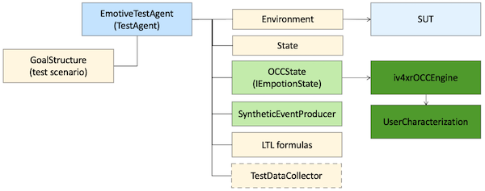

## UX Testing with OCC

**OCC** standards for "Ortony-Clore-Collins". It refers to a [theory from Psychology](https://www.ncbi.nlm.nih.gov/pmc/articles/PMC4243519/#:~:text=The%20model%20proposed%20by%20Ortony%2C%20Clore%2C%20and%20Collins%20(commonly,and%20those%20focused%20on%20objects.) about different types of emotions (e.g. hope, distress, etc) and what makes them emerge. The theory has been formalized into computational models by various computer scientists, providing a way to 'predict' when certain emotion emerges. By 'predicting' we mean that such a computational model, if additionally given a model of a person's mental process, will be able to calculate if certain emotions would emerge when e.g. we simulate the occurrence of some events on the person.

We can use ix4xr **emotive testagent** to use such an OCC-based computational model to do user experience (UX) testing. Under the hood, we use a package called [JOCC](https://github.com/iv4xr-project/jocc) that provides an implementation of an OCC Computational Model. A typical example would be to test the user experience of a given computer game, e.g. whether certain areas or certain scenarios trigger the right emotion, or the right patterns of emotion.

The theory behind JOCC computational model can be found in this paper:

-----

[_An Appraisal Transition System for Event-Driven Emotions in Agent-Based Player Experience Testing_](https://arxiv.org/pdf/2105.05589), Ansari, Prasetya, Dastani, Dignum, Keller. In
International Workshop on Engineering Multi-Agent Systems (EMAS), 2021.

-----

JOCC is a 'model-based' approach (as opposed to a machine-learning based approach). This means that we first to construct a model of a user's 'mental process' (we will get back to what this means later). JOCC then uses this model to calculate which emotions would emerge when the user receives certain events, and how the intensity of these emotions would decay over time. This means that if we now run a test scenario on the SUT, and let JOCC monitors the run, it then can predicts which emotions would emerge during the scenario, and how they would decay. This can be matched with some requirements as a form of User Experience (UX) testing.

JOCC has six types of emotions: _hope_, _joy_, _satisfaction_, _fear_, _distress_, and _disappointment_. Only event-driven and goal-oriented emotions are considered in JOCC. The goal-oriented part means that we only consider emotions directed towards some goals. For example, if we are testing a game, we can think goals like g1 = "collecting (enough) gold coins" and g2 = "getting to the next level". Emotions such as being "hopeful" are then defined towards achieving such goals, e.g. being hopeful towards (achieving) g1 and being hopeful towards g2. These two "hopes" can co-exist.

The event-driven part means that we only consider emotions that emerge due to the occurrence of events. For example, seeing a treasure chest that was not seen before (an event) may trigger the emergence of hope towards achieving g1. Being badly hurt by a monster (event) may trigger fear towards achieving g2, maybe also towards g1.

JOCC itself contains some generic parts e.g. for calculating how emotions decay. But it cannot do all the calculations. It needs need some SUT-specific information as well. E.g. if we are testing a game X, JOCC will need some information about which goals are relevant for X's users/players (e.g. g1 and g2 above), and what are their relative importance.
We also need to specify what are the events that are relevant towards influencing players' emotion towards these goals, e.g. seeing a treasure chest, or being hit by a monster as in the example above, and how desirable these events are towards each goal.

JOCC's most important source of information to calculate how emotions emerge is the current likelihood of achieving each goal. Well.. we don't actually know this likelihood. Moreover, what we want is not the actual likelihood, but rather, how players would perceive what the likelihood is (e.g. do players think that achieving g1 now becomes quite likely, or conversely very unlikely?). We also don't know how players would perceive this, but we can still model how we think they would perceive. This is what is meant by "modelling players' mental process" that we mention before. In fact, specifying all parameters that JOCC needs before we can use it (e.g. specifying what are players' goals, the desirability of events, and how they affect goals' likelihood etc) is what we mean by modelling players. In JOCC, this is called **Player Characterization**; JOCC will need such a characterization before it can do its work.

The general steps to do UX testing with JOCC are as follows:

   1. Construct a Player Characterization. You only need to do this once for every SUT, but you may want to tune it over several iterations to get a model/characterzation that are reasonable.

   2. Construct one or more test cases (test scenarios), e.g. several plays of a game e.g. all finish the game, but in different ways.

   3. Use an iv4xr **emotive-testagent** to run the scenarios. We also hook in JOCC to the test agent. This results in the test agent has its state extended with an emotion state.

   4. We can e.g. use an Linear Temporal Logic (LTL) formula to express what kind of patterns of emotions we expect to see on those test runs, and then have this LTL formula checked during the agent's run. It will result in either: the LTL formula is satisfied (by the test case), or violated.

### The Architecture of iv4xr Emotive Testagent

The picture above shows the general architecture of an emotive test-agent. Such an agent is an instance of the class `EmotiveTestAgent`, which is a subclass of `TestAgent`. The agent has various components. The most important ones for now are:

   * An 'environment' that connects it to the SUT.
   * We can give the agent a 'goal structure', which can be thought as describing a test scenario, which the agent can run.
   * The agent has a state, but additionally also an emotion-state (and instance of the class `OCCState`). This emotion state is not updated directly by the agent, but instead by an OCC-engine (an instance of `iv4xrOCCEngine`, which in turns is a subclass of JOCC's `EmotionAppraisalSystem`).
   This OCC-engine will need some SUT-specific model of its users. This is the UserCharacterization component.

### PX Testing with JOCC by Example: [see here](./occ-example.md)

### API References

### Relevant papers

[_An Appraisal Transition System for Event-Driven Emotions in Agent-Based Player Experience Testing_](https://arxiv.org/pdf/2105.05589), Ansari, Prasetya, Dastani, Dignum, Keller. In
International Workshop on Engineering Multi-Agent Systems (EMAS), 2021.
