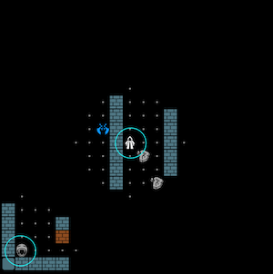

## Emotive Testing with OCC

**OCC** standards for "Ortony-Clore-Collins". It refers to a [theory from Psychology](https://www.ncbi.nlm.nih.gov/pmc/articles/PMC4243519/#:~:text=The%20model%20proposed%20by%20Ortony%2C%20Clore%2C%20and%20Collins%20(commonly,and%20those%20focused%20on%20objects.) about different types of emotions (e.g. hope, distress, etc) and what makes them emerge. The theory has been formalized into computational models by various computer scientists, providing a way to 'predict' when certain emotion emerges. By 'predicting' we mean that such a computational model, if additionally given a model of a person's mental process, will be able to calculate if certain emotions would emerge when e.g. we simulate the occurrence of some events on the person.

This part of iv4xr offers a way to use such an OCC-based computational model to test user experience (UX). Under the hood, we use a package called JOCC that provides an implementation of an OCC Computational Model. A typical example would be to test the user experience of a given computer game, e.g. whether certain areas or certain scenarios trigger the right emotion, or the right patterns of emotion.


The theory behind JOCC computational model can be found in this paper:

-----

[_An Appraisal Transition System for Event-Driven Emotions in Agent-Based Player Experience Testing_](https://arxiv.org/pdf/2105.05589), Ansari, Prasetya, Dastani, Dignum, Keller. In
International Workshop on Engineering Multi-Agent Systems (EMAS), 2021.

-----

JOCC is a 'model-based' approach (as opposed to a machine-learning based approach). This means that we first to construct a model of a user's 'mental process' (we will get back to what this means later). JOCC then uses this model to calculate which emotions would emerge when the user receives certain events, and how the intensity of these emotions would decay over time. This means that if we now run a test scenario on the SUT, and let JOCC monitors the run, it then can predicts which emotions would emerge during the scenario, and how they would decay. This can be matched with some requirements as a form of User Experience (UX) testing.

JOCC has six types of emotions: hope, joy, satisfaction, fear, distress, and disappointment. Furthermore, only event-driven and goal-oriented emotions are considered (this is not to say that these are the only aspects that can trigger emotion; but just limit ourself to the aforementioned setup). The goal-oriented part means that we only consider emotions directed towards some goals. For example, if we are testing a game, we can think goals like g1 = "collecting (enough) gold coins" and g2 = "getting to the next level". Emotions such as being "hopeful" are then defined towards achieving such goals, e.g. being hopeful towards (achieving) g1 and being hopeful towards g2. These two "hopes" can co-exist.

The event-driven part means that we only consider emotions that emerge due to the occurrence of events. For example, seeing a treasure chest that was not seen before (an event) may trigger the emergence of hope towards achieving g1. Being badly hurt by a monster (event) may trigger fear towards achieving g2, maybe also towards g1.

JOCC itself contains some generic parts e.g. for calculating how emotions decay. But it cannot do all the calculations. It needs need some domain-specific information as well. E.g. if we are testing a game X, JOCC will need some information about X. For example, we need to specify which goals are relevant for X's players (e.g. g1 and g2 above), and what are their relative importance.
We also need to specify what are the events that we consider relevant towards influencing players' emotion, e.g. seeing a treasure chest, or being hit by a monster as in the example above, and how desirable these events are towards each goal.

JOCC's most important source of information to calculate how emotions emerge is the current likelihood of achieving each goal. Well.. we don't actually know this likelihood. Moreover, what we want is not the actual likelihood, but rather, how players would perceive what the likelihood is (e.g. do players think that achieving g1 now becomes quite likely, or conversely very unlikely?). We also don't know how players would perceive this, we can still model how we think they would perceive. This is what is meant by "modelling players' mental process" that we mention before. In fact, specifying all parameters that JOCC needs before we can use it (e.g. specifying what are players' goals, the desirability of events, and how they affect goals' likelihood etc) is what we mean by modelling players. In JOCC, this is called **Player Characterization**; JOCC will need such a characterization before it can do its work.

The general steps to do UX testing with JOCC are as follows:

   1. Construct a Player Characterization. You only need to do this once for every SUT, but you may want to tune it over several iterations to get a model/characterzation that makes sense.

   2. Construct one or more test cases (test scenarios), e.g. several plays of a game e.g. all finish the game, but in different ways.

   3. Use an iv4xr test agent to run the scenarios. We also hook in JOCC to the test agent. This results in the test agent has its state extended with an emotion state.

   4. We can e.g. use an Linear Temporal Logic (LTL) formula to express what kind of patterns of emotions we expect to see on those test runs, and then have this LTL formula checked during the agent's run. It will result in either: the LTL formula is satisfied (by the test case), or violated.


### Using JOCC by Example

As an example we will use the game MiniDungeon as our (System Under Test/SUT). This game is included in the packaging of iv4xr. This example is not meant to be complete; we just want to show the steps needed to use JOCC. Some screenshots are shown below. Players' avatars are circled in blue (one or two players can play in the same game). Players actually have limited sight; the screenshot to the left shows how the game actually look like for players. The screenshot on the right shows an entire game-level by artificially set the players' visibility range to unlimited.



In this game, the player can go from one level to the next one, until it gets to the final level. Access to the next level is guarded by a shrine, which can teleport the player to the next level. However, the shrine must be cleansed first before it can be used as a teleporter. To cleanse it, the player need to use a scroll (gray icon in the game). There are usually several scrolls dropped in a level, but only one of them (a holy scroll) can do the cleansing. The player does not know which scroll is holy until it tries to use it on a shrine. There are also monsters in the levels that can hurt the player, but also potions that can heal the player or enhance its combat.

Imagine we want to run some test scenarios to see that the first level of MiniDungeon can generate tension. In terms of OCC, we want to see if one of these scenarios would generate the distress emotion, or at least fear.

#### 1. Determine the goals and relevant events.

As a goal of interest, let us take g = "a shrine is cleansed". If we specify this to JOCC, it means that emotions it produce would emotions with respect to this g. We could have more goals, but here let us just have g as our only goal of interest. Since the player starts in level-1 of the game, and there is only one shrine there, then g simply means the shrine of level-1 is cleansed.

Next we decide what "events" would be relevant towards this goal g. For this example let's just restrict to the following events:

   1. "OUCH": triggered when a monster hits/hurts the player.
   2. "HEAL": tiggered when the player heals itself by drinking a health potion.
   3. "SEESHRINE": triggered when the player sees level-1 shrine for the first time.
   4. "CLEANSE": triggered when the player manages to cleanse level-1 shrine.

The game does not actually produces these events as (it was not implemented using an event-system), but we would argue that players experience them as meaningful changes, hence "events". Since the game does not produce these events (as "objects" that we can intercept), we somehow have to produce them so that they are visible to JOCC. We can do this by implementing the abstract class `SyntheticEventsProducer`. A fragment of this implementation for MiniDungeon is shown below:

```Java
public class MiniDungeonEventsProducer extends SyntheticEventsProducer {
  ...
  public void generateCurrentEvents() {
     ...
     var player = wom.elements.get(wom.agentId) ;
     var prevState = player.getPreviousState() ;
     if (..) // if player's hp < its hp in the prevState
        currentEvents.add(OUCH) ;
    ...
  }
}
```

The full implementation is [here](../src/main/java/nl/uu/cs/aplib/exampleUsages/miniDungeon/testAgent/MiniDungeonEventsProducer).


#### 2. Constructing a Player Characterization

Before we can

```java
public class MyUserCharacterization extends UserCharacterization {
  ...
}
```

```java
var emotionAppraisalSystem = new EmotionAppraisalSystem("agentSmith") ;
eas.addGoal("goal1",10)
   .addGoal("goal2",5)
   .withUserModel(new MyUserCharacterization())
```

```java
var emotiveAgent = new EmotiveTestAgent("agentSmith","role") ;

var occState = new OCCState(emotiveAgent,emotionAppraisalSystem) ;

emotiveAgent.attachState(state)
  .attachEnvironment(env)
  .setTestDataCollector(testdata)
  .attachSyntheticEventsProducer(evensGenerator)
  .attachEmotionState(occState)

emotiveAgent.setGoal(G)
```

```java
for(int cycle i=0; i<maxBudget; cycle++) {
  emotiveAgent.update() ;
  var emotions = emotiveAgent.getEmotionState().getCurrentEmotion() ;
  // do something with the emotions :)
}
```

### API References

### Relevant papers
