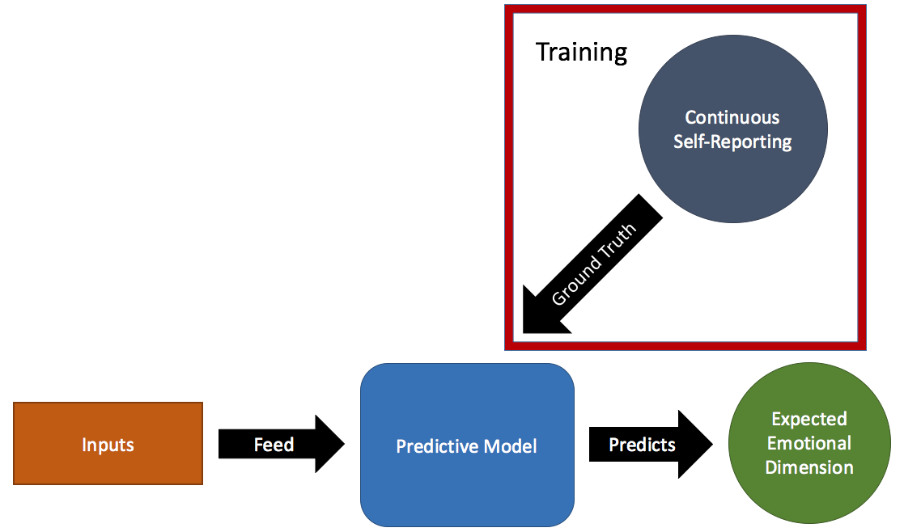

## The PAD Model of Emotion

One of the components of UX is the emotional state of the user, which is altered by the interaction of the user with the system under test. One of the modules developed for the iv4XR framework is an emotional predictive module based on the PAD model of emotion. This model describes human emotions based on three dimensions: Pleasure; Arousal; and Dominance. For this module, we used machine learning to train a predictive model for the dimensions of the PAD model based on data collected from the system under test.

### PAD on the iv4XR framework

The code for training and running the machine learning model able to predict the three dimensions of the PAD model is written in python and can be found in the `iv4xr-framework/python/src/pad/` folder. Agents built using the iv4XR framework can train and predict PAD emotional dimension by using the methods present in the PADModel class found in the `iv4xr-framework/src/main/java/eu/iv4xr/framework/extensions/pad/` folder.

The methods of the PADModel class are:

* `trainModel(String folder_path)`

  This trains three predictive models (one for each of the PAD dimensions) based on the annotated traces found in the folder `folder_path`.

* `trainAndSaveModel(String folder_path)`

  This trains and saves as files three predictive models (one for each of the PAD dimensions) based on the annotated traces found in the folder `folder_path`.

* `predictWithTrainedModel(String folder_path, String pad_dimension, String trained_model_file)`

  This predicts the expected emotional classes for the `pad_dimension` dimension of the traces found in the `folder_path` folder using the trained model found in the path given by the `trained_model_file` variable.

### [Example](./pad-example.md)
