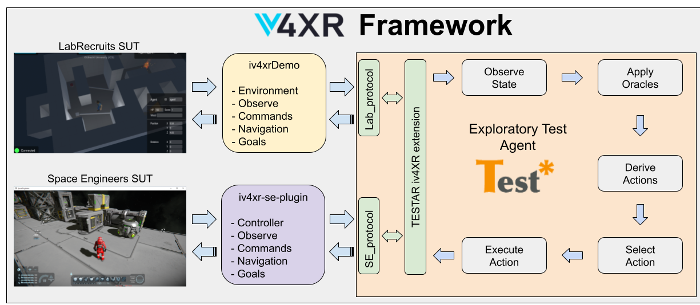

# Exploratory Test Agent

## TESTAR tool
TESTAR is a scriptless testing tool [TESTAR_iv4xr](https://github.com/iv4xr-project/TESTAR_iv4xr/wiki) that works as an exploratory agent in the iv4xr-framework.  

TESTAR connects with the XR System Under Test (SUT), recognizes all virtual entities (in an observation range), derives the actions intended to reach or interact with these entities, and automatically selects actions to explore the virtual environment.  

In each state, after executing an action in the XR systems, TESTAR applies a set of oracles to determine if the SUT contains a failure. These oracles are customizable and can help to check that the SUT process runs properly without freezing, that the entities' properties are responding adequately to the executed actions, or that the state or log of the SUT does not contain suspicious messages such as `error` or `exception`.  



### Configuration
[TESTAR Java protocols](https://github.com/iv4xr-project/TESTAR_iv4xr/wiki/TESTAR-Java-Protocols) allow users to define how the agent connects and interacts with the SUT. A default set of protocols in the directory `assets/testar/settings` contains the customizable java protocols and a test.settings files. It is also possible to add new directories with additional protocols.  


### Results
TESTAR creates two main types of results while exploring the XR systems:  
- HTML report that indicates the observed state and executed actions step-by-step with textual and visual information. This HTML report is always active and created in an `output` folder by default.  

- [State Model inferred](https://github.com/iv4xr-project/TESTAR_iv4xr/wiki/State-Model-and-OrientDB-instructions) that contains information regarding how the exeuted actions allow transit between the observed states. In order to use the State Model functionality, it is necessary to configure the OrientDB database.  


## iv4XR framework integration

### LabRecruits SUT
TESTAR needs to know where the XR system is located (indicated in the test.settings file). We needed to extract the portable game LabRecruits in the directory `suts/gym/windows`, and configure the [LabRecruits protocol files](https://github.com/iv4xr-project/TESTAR_iv4xr/wiki/LabRecruits-instructions).  

### Space Engineers SUT
TESTAR needs to know how to connect with the XR system (indicated in the test.settings file). Space Engineers (SE) is not portable such as LabRecruits. In order to use TESTAR with SE, the user needs to follow the [SE installation instructions](https://github.com/iv4xr-project/iv4xr-se-plugin#manually-putting-dll-libraries-into-the-game). Once the iv4xr-se-plugin is ready to work with SE, the user can configure the [Space Engineers protocol files](https://github.com/iv4xr-project/TESTAR_iv4xr/wiki/Space-Engineers-instructions).

### TESTAR agent dependency
We use jitpack with java 11 in the main TESTAR repository [TESTAR_iv4xr](https://github.com/iv4xr-project/TESTAR_iv4xr) to build the software libraries. We can indicate the desired TESTAR version to be imported into the framework within the pom.xml file :
```
    <dependency>
        <groupId>com.github.iv4xr-project</groupId>
        <artifactId>TESTAR_iv4xr</artifactId>
        <version>v3.4</version>
    </dependency>
```

### windows.dll dependency
TESTAR uses Windows Accessibility API to manage XR systems processes in Windows environments, take Windows systems screenshots, and create a Canvas with Spy mode to paint visual information. Currently, this implementation is available by using the dynamic link library `assets/windows10/windows.dll`  

## Launch TESTAR exploratory agent
TESTAR uses its own action selection algorithm to explore and test XR systems. It does not follow specific goal structures or state machine models for decision-making. Based on a protocol, the TESTAR agent will explore the XR system until it reaches the maximum number of actions or the time limit or until an error is found in the system.  

1. Compile the project using maven instructions: `mvn clean install`  
2. Run `TestarExecutor` as a Java application.  

### TestarExecutor does
- Prepares the `windows.dll` file  
- Loads the desired SUT protocol and settings 
- Creates and executes the TESTAR exploratory agent  

### TestarFactory does
- Implements the iv4xr ITestFactory interface  
- Use the loaded settings to compile and run the TESTAR protocol as an exploratory agent   

## Papers

* Vos, T. E., Aho, P., Pastor Ricos, F., Rodriguez Valdes, O., & Mulders, A. (2021). *testar–scriptless testing through graphical user interface.* Software Testing, Verification and Reliability, 31(3), e1771. [doi.org/10.1002/stvr.1771](https://doi.org/10.1002/stvr.1771)  

* Pastor Ricós, F. (2022). *Scriptless Testing for Extended Reality Systems.* In International Conference on Research Challenges in Information Science (pp. 786-794). Springer, Cham. [doi.org/10.1007/978-3-031-05760-1_56 ](https://doi.org/10.1007/978-3-031-05760-1_56)  

* Mulders, A., Valdes, O.R., Ricós, F.P., Aho, P., Marín, B., Vos, T.E.J. (2022). State Model Inference Through the GUI Using Run-Time Test Generation. In: Guizzardi, R., Ralyté, J., Franch, X. (eds) Research Challenges in Information Science. RCIS 2022. Lecture Notes in Business Information Processing, vol 446. Springer, Cham. [doi.org/10.1007/978-3-031-05760-1_32](https://doi.org/10.1007/978-3-031-05760-1_32)  

* I. S. W. B. Prasetya, Fernando Pastor Ricós, Fitsum Meshesha Kifetew, Davide Prandi, Samira Shirzadehhajimahmood, Tanja E. J. Vos, Premysl Paska, Karel Hovorka, Raihana Ferdous, Angelo Susi, and Joseph Davidson. 2022. An agent-based approach to automated game testing: an experience report. In Proceedings of the 13th International Workshop on Automating Test Case Design, Selection and Evaluation (A-TEST 2022). Association for Computing Machinery, New York, NY, USA, 1–8. [doi.org/10.1145/3548659.3561305](https://doi.org/10.1145/3548659.3561305)  